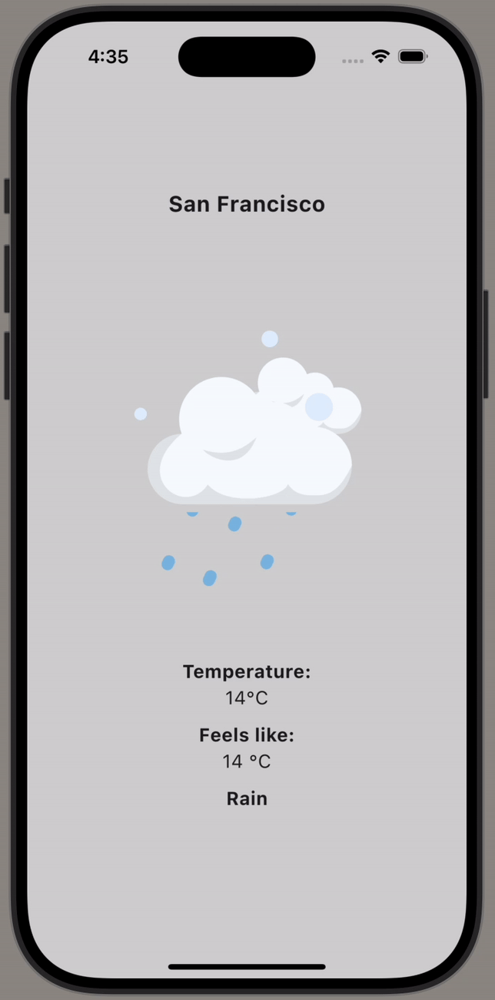

# my_weather_app
 Flutter weather app

 Trying to learn how to incorprate APIs and working with flutter for first time.
 Mostly follows: https://www.youtube.com/watch?v=yLtpMqvMgdY, but have added extra functionality/styling to build on to it more.

 Here's the output:
 
 
